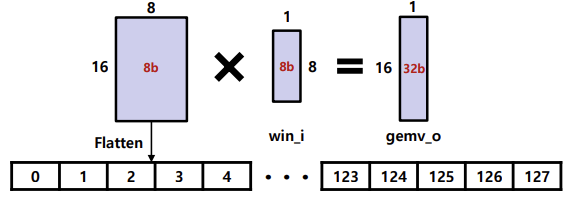
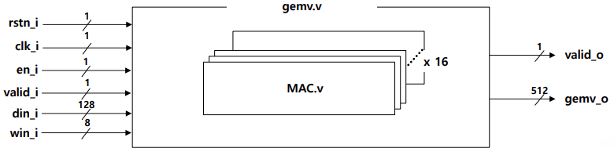
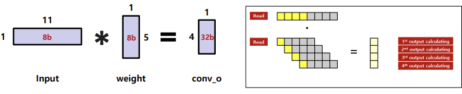
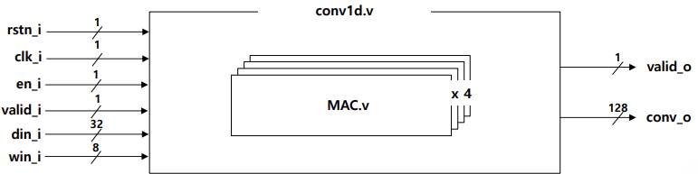
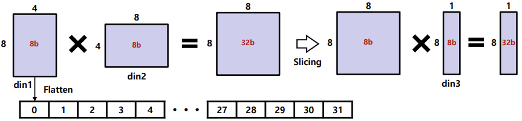
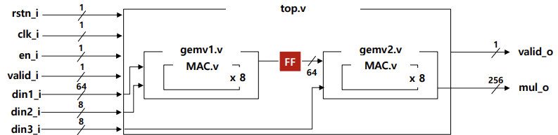

# Advanced Practice 1 – DSP & Parallel Operations

This project contains Verilog HDL implementations for **Advanced Practice 1** of Digital System Design (DSD25).  
The focus is on designing DSP-based multiply-accumulate operations and applying them to GEMV, Conv1d, and 2-stage GEMM→GEMV.

---

## Problem 1 — GEMV Operation:contentReference[oaicite:0]{index=0}
- Input: **16×8 matrix** × **8×1 vector**  
- Output: **16×1 vector (signed 32-bit)**  
- All multipliers are **signed** and run **in parallel**.

**Dataflow/Block Diagram**  

  

---

## Problem 2 — Conv1d Operation:contentReference[oaicite:1]{index=1}
- Input: **1×11 vector**, Kernel: **5×1 vector**  
- Stride = 2, Kernel size = 5  
- Output: **4×1 vector (signed 32-bit)**  
- Negative inputs represented in **two’s complement** (e.g., -1 = 8’hFF).

**Dataflow/Block Diagram**  

  

---

## Problem 3 — 2-stage GEMM → GEMV:contentReference[oaicite:2]{index=2}
- Input: **8×4 matrix × 4×8 matrix** → intermediate **8×8 result**.  
- Slice result to **8-bit** and feed into GEMV with **8×1 vector**.  
- Demonstrates **multi-stage dataflow** and bit slicing.

**Dataflow/Block Diagram**  

  

---

## Verification
- All modules were verified using **testbench simulation** with deterministic input vectors.  
- Waveforms confirmed correct signed arithmetic and parallel execution.  
- **STA (Static Timing Analysis)** was performed after synthesis and implementation, confirming positive slack and timing closure for all modules.  

---
