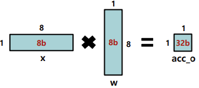
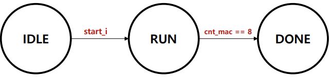
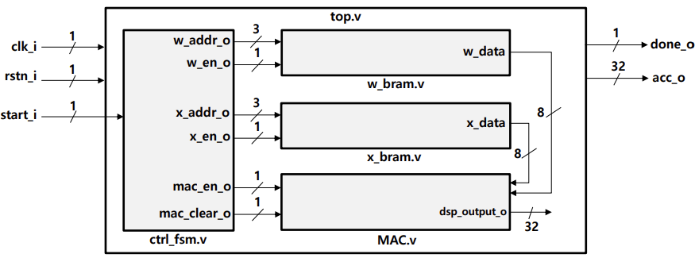
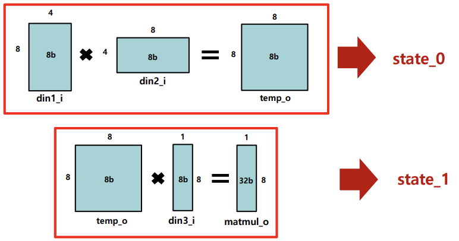
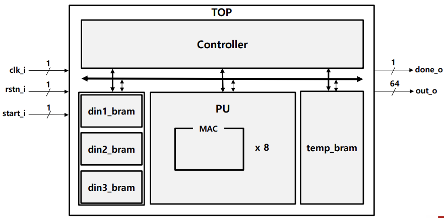
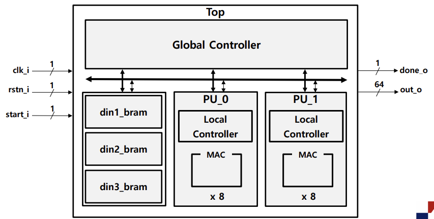

# Advanced Practice 2 – Controller Architectures

This project contains Verilog HDL implementations for **Advanced Practice 2** of Digital System Design (DSD25).  
The focus is on designing controllers (FSM-based, Recursive, Streamline) for vector/matrix multiplication.

---

## Problem 1 — Simple Controller:contentReference[oaicite:3]{index=3}
- FSM states: **IDLE → RUN → DONE**  
- Manages BRAM (x, w) and MAC enable.  
- Counts 8 MAC cycles then signals completion.

**Dataflow/State Diagram/Block Diagrams**  

  
  

---

## Problem 2 — Recursive Controller:contentReference[oaicite:4]{index=4}
- Matrix multiplication divided into **2 states**.  
- A single PU is **reused sequentially**.  
- Fewer resources, longer latency.

**Dataflow/Block Diagram**  

---

## Problem 3 — Streamline Controller:contentReference[oaicite:5]{index=5}
- **2 Processing Units (PUs)** working in parallel.  
- One **global controller** and **2 local controllers**.  
- More resources, higher throughput.

**Block Diagrams**  
  

---

## Verification
- Testbenches (`tb_*.v`) were developed for each controller type.  
- Waveforms validated FSM transitions and correct accumulation results.  
- **STA (Static Timing Analysis)** confirmed timing closure with positive slack, ensuring stable operation of FSM and datapath modules.  

---
