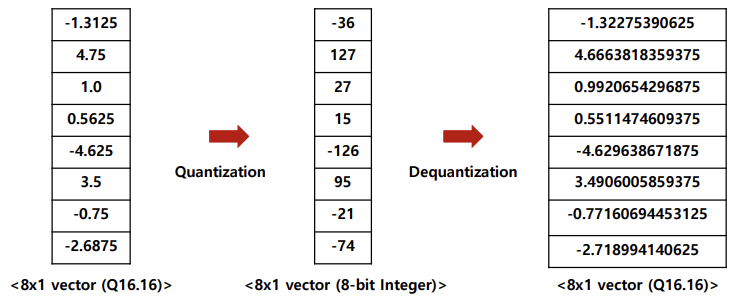
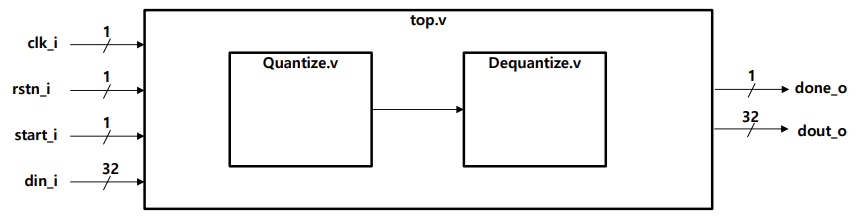
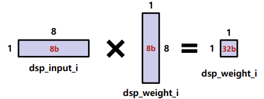
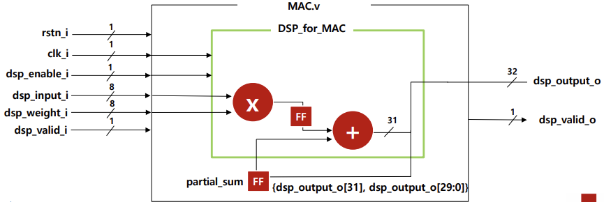
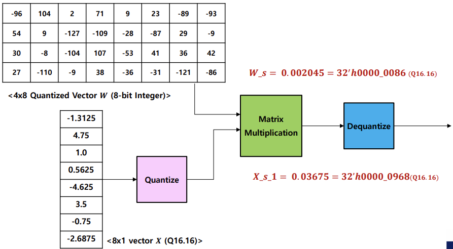
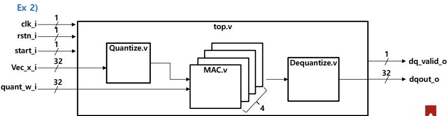

# Advanced Practice 3 – Quantization & Arithmetic

This project contains Verilog HDL implementations for **Advanced Practice 3** of Digital System Design (DSD25).  
The focus is on quantization, dequantization, and integer arithmetic for vectors and matrices.

---

## Problem 1 — Vector Quantization:contentReference[oaicite:6]{index=6}
- Input: **8×1 vector in Q16.16**  
- Output: **8-bit quantized vector**  
- Formula:  
  - Scaling: \\( s = (β − α) / (2^b − 1) \\)  
  - Quantization: \\( x_q = clip(round(x/s)) \\)  
  - Dequantization: \\( Out_{dq} = X_s^{-1}·W_s·Out \\)

**Dataflow/Block Diagrams**  

  

---

## Problem 2 — Vector Multiplication with Quantization:contentReference[oaicite:7]{index=7}
- Input: Vector **X (Q16.16)** and quantized vector **W (8-bit)**  
- Process: Quantize X, multiply with W, then dequantize.  
- Output: Dequantized scalar/vector result.

**Dataflow/Block Diagrams**  

  

---

## Problem 3 — Matrix Multiplication with Quantization:contentReference[oaicite:8]{index=8}
- Input: Vector **X (Q16.16)** and quantized **matrix W (8-bit)**  
- Process: Quantize → Matrix Multiply → Dequantize.  
- Output: Dequantized vector.

**Dataflow/Block Diagrams**  

  

---

## Verification
- Each module was tested with **dedicated testbenches** to validate correctness.  
- Simulation waveforms confirmed accurate quantization/dequantization and arithmetic operations.  
- **STA (Static Timing Analysis)** was completed after synthesis/implementation; all designs met timing with positive slack.  

---
